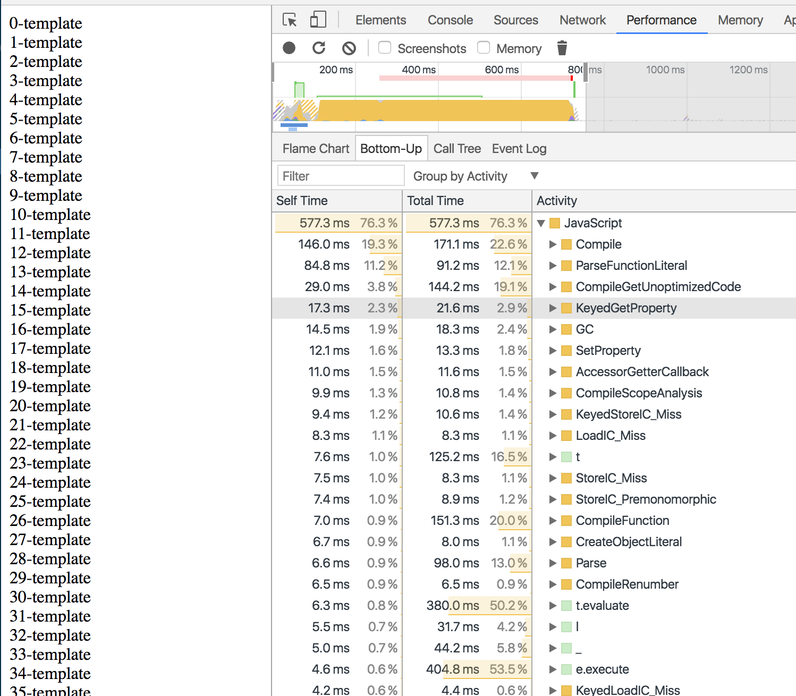
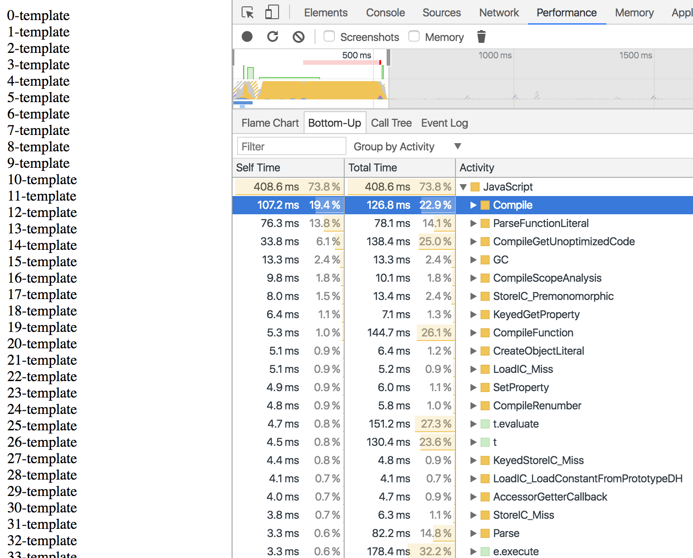

# sloshing-example

This example quickly shows the cost associated with not leveraging JITd code in V8. The example is pretty simple, render 200 components on the page.

## Not leveraging JITd Code

## Leveraging JITd Code (About 200ms faster)

The difference here is that in the first example we iterate 200 times, rendering a specific component for each item in the list. This means the we use the component once the VM never sees it again. However, optimized code was compiled for it, but we never use it again.

The second example uses the a single component and we just create new instances of it with different data. Because the same code is seen many times it leverages the optimized code and can even optimize further as it becomes hot.

This has nothing really to do with Ember, but more of the fact that the system you are writing against can go way faster if you work within its assumptions.

To reproduce please do `ember server --environment=production`. Then comment/uncomment out the each blocks in application.hbs.
